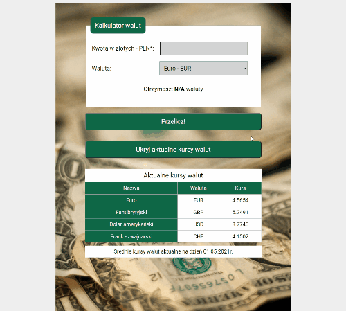

# Currency Converter

Welcome to my currency calculator!

## Preview of the website 

Click here to see my website: [Currency-conventer demo](https://izabelanowak.github.io/currency-converter/)

## Description

There is simple currency calculator. You can enter amount of PLN (Polish złoty) and after click in button (Przelicz!) currency is calculated to selected currency. You can choose euro (EUR), pound (GBP), dollar (USD) or swiss franc (CHF).
Below the converter there is a table with the average exchange rates valid as of 01/05/2021.
You can hide/show table with exchange rates with click of the button.

## How to use
See gif below to see how my calc works!

## Used technologies:

-   Semantic HTML
-   CSS
-   BEM naming
-   ES6+ features
